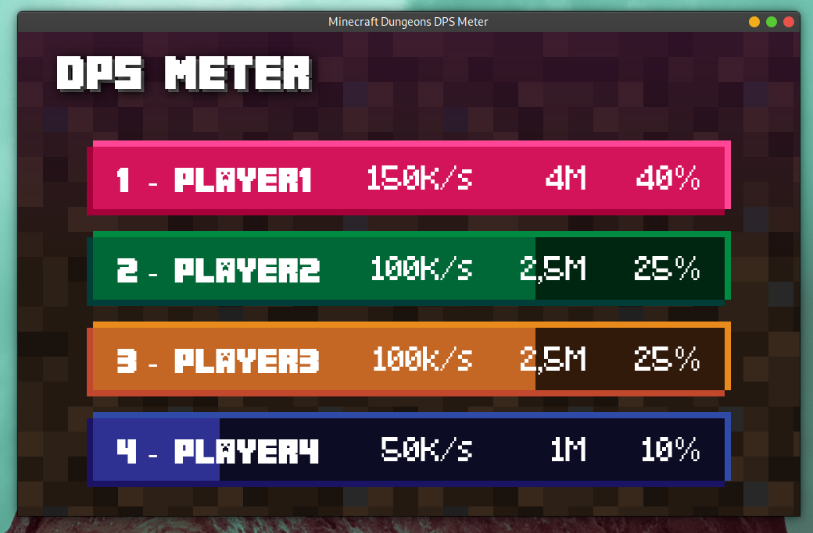
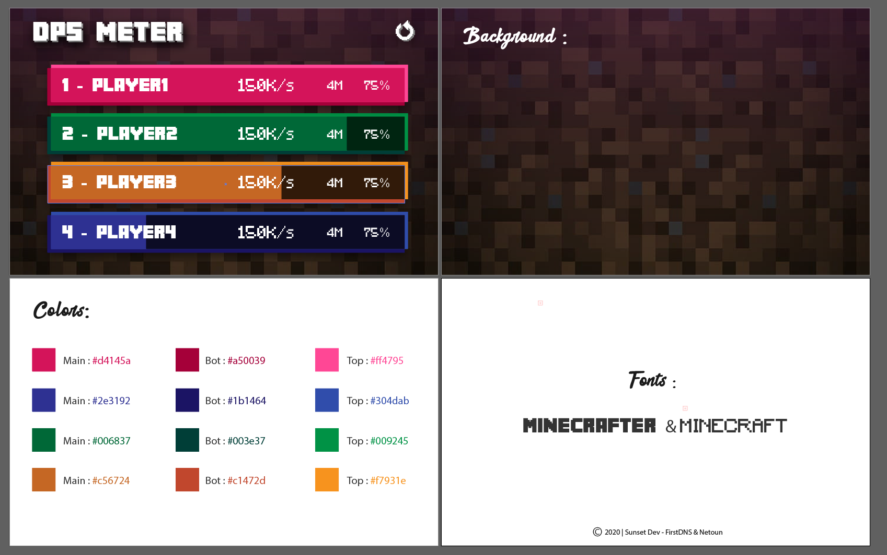

# Minecraft Dungeons DPS Meter

###### Project made with [@Netoun](https://github.com/Netoun)

> _"Minecraft: Dungeons is an all-new action-adventure game, inspired by classic dungeon crawlers and set in the Minecraft universe!"_
> IGN - https://www.ign.com/games/minecraft-dungeons

In **Minecraft Dungeons**, it is often hard to know which stuff is better than other. A **DPS Meter** is a tool that displays the number of **D**amage **P**er **S**econd a player inflicts.

The aim of this project is to build the app that will display DPS to the user.

## Actual app look

  
Mockup

  
  

## Targeted technical stack:

- App wrapper: [Electron](https://github.com/electron/electron)
- JS library: [Preact](https://github.com/preactjs/preact)
  - State management: [Hooks](https://reactjs.org/docs/hooks-intro.html) + [Context API](https://reactjs.org/docs/context.html)
- Style management: [Emotion](https://github.com/emotion-js/emotion)

## Use repo

Start development environment:
`yarn electron-dev`

Build:
`yarn electron-pack`
